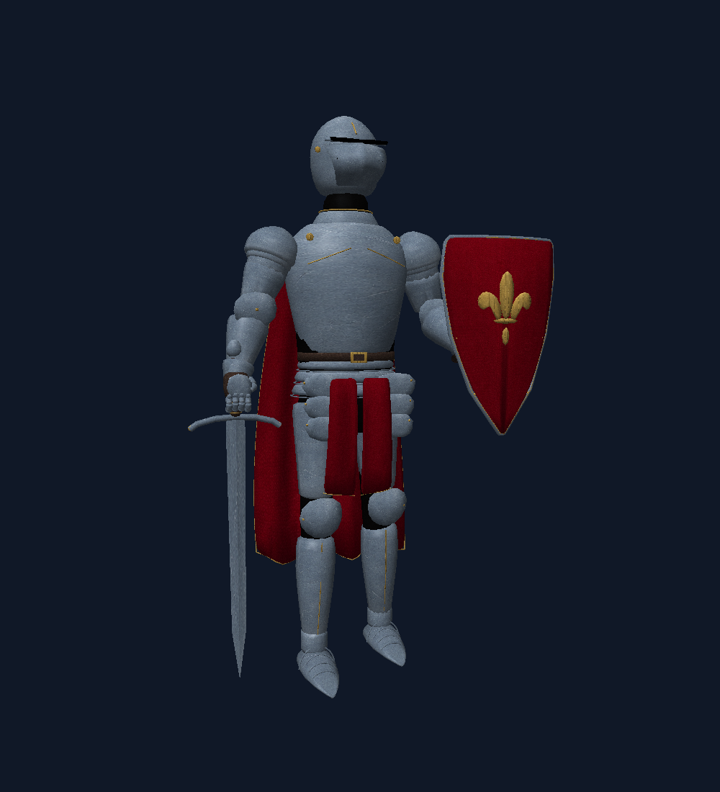

# Rasterizer — Crimson Sentinel

A small C++17 software rasterizer with native Windows and macOS viewers. The bundled **Crimson Sentinel** knight is a fully textured Wavefront OBJ built in Blender: fitted curved steel armor, gold trim, a crimson cape and tabard, sword, and heraldic shield.



## Run on Windows

Extract the complete Windows ZIP from a release or a successful GitHub Actions build and launch `Rasterizer.exe`. Keep `assets/` beside the executable. The ZIP includes the C++ runtime statically, so there is no separate Visual C++ runtime installer. No graphics SDK or external rendering library is required.

| Control | Action |
| --- | --- |
| Drag left mouse / arrow keys | Orbit the model |
| Mouse wheel / W and S | Zoom in and out |
| R | Reset the view |
| Escape | Close the viewer |

The viewer locates its assets relative to the executable, so it also works when opened from Explorer or an IDE with another working directory.

## Build on Windows

Install Visual Studio 2019 or later (or Build Tools) with **Desktop development with C++**, a Windows SDK, and **C++ CMake tools for Windows**. CMake 3.20 or later is required.

From PowerShell in this repository:

```powershell
powershell -ExecutionPolicy Bypass -File .\tools\build_windows.ps1
```

The script locates CMake, builds Release, runs CTest, and creates a distributable ZIP under `build/packages/`. It does not install dependencies. You can also use CMake directly from a developer terminal:

```powershell
cmake -S . -B build -A x64
cmake --build build --config Release --parallel
ctest --test-dir build -C Release --output-on-failure
.\build\bin\Release\Rasterizer.exe
cpack --config build\CPackConfig.cmake -C Release -B build\packages
```

For Visual Studio 2019 specifically, append `-G "Visual Studio 16 2019"` to the configure command. Build outputs and the copied assets are under `build/bin/Release/`.

## Build on macOS

Install Xcode command-line tools and CMake, then:

```sh
cmake -S . -B build -DCMAKE_BUILD_TYPE=Release
cmake --build build --parallel
ctest --test-dir build --output-on-failure
./build/bin/Release/Rasterizer
cpack --config build/CPackConfig.cmake -C Release -B build/packages
```

The macOS application uses Cocoa and the same scene, textures, and renderer as Windows. Linux can build the command-line renderer and tests; the native viewers target Windows and macOS.

## Use the knight in another application

Import `assets/knight/knight.obj` with its neighboring `knight.mtl` and `knight_atlas.png` files. The OBJ is triangulated, includes UVs and surface normals, and uses standard `map_Kd` material references. The editable [Blender source](source/README.md) is included at `source/knight.blend`. See [asset notes](assets/knight/README.md) for layout, scale, and regeneration instructions.

## Render without a window

```powershell
.\build\bin\Release\rasterizer_render.exe
.\build\bin\Release\rasterizer_render.exe assets\knight\knight.obj knight.ppm --width 1000 --height 1100 --zoom 1
.\build\bin\Release\rasterizer_render.exe assets\knight\knight.obj knight-back.ppm --yaw 180
```

The default model is the bundled knight. The optional camera arguments offset the initial view. Run `rasterizer_render --help` for all options. Output is a binary RGB PPM image, generated by the same C++ rasterizer that draws the native window. The README preview is an image-format conversion of that output.

## Renderer and validation

The shared core supports OBJ positions, per-corner UVs and normals, positive and negative face indices, convex polygon triangulation, MTL diffuse colors, and PNG diffuse maps. It uses perspective-correct texture interpolation, depth testing, near/side-plane clipping, diffuse lighting, and view-dependent highlights from MTL `Ks`/`Ns` values. Unsupported `map_Kd` options report an error; use a plain PNG path. Normal maps, specular texture maps, and transparent materials are not implemented.

CTest checks malformed OBJ input, negative indices, material/PNG loading, texture orientation and UV seams, perspective interpolation, draw-order-independent depth, clipping, framebuffer clearing, and the bundled knight. The Windows/macOS CI workflow builds, tests, and packages the viewer and its assets on pushes and pull requests.

The PNG decoder is a pinned copy of [stb_image](third_party/README.md); its license is included in source and packaged builds.
