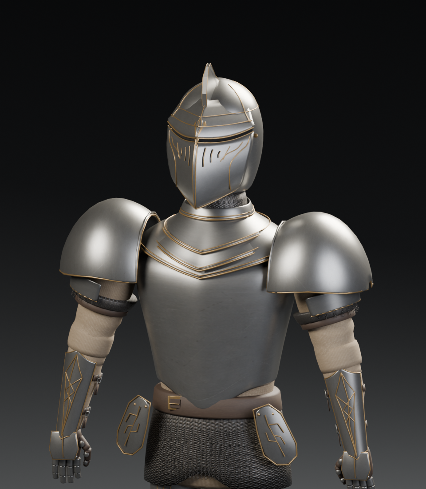

# Gilded Warden

An original reference-inspired knight authored in Blender for this software rasterizer. Its armor combines a crested closed helmet, narrow antique gold tracery, a pointed cuirass, layered V-shaped gorget, domed shoulder shells, engraved leaf-shaped tassets, fitted gauntlets, and articulated sabatons. Tan arming garments, leather straps, and exposed chainmail connect the armor in a relaxed, unarmed pose.

## Files

- `knight.obj`: 120,154 triangles, 60,972 deduplicated positions, and 370 named components, with independent per-corner UVs and normals.
- `knight.mtl`: six materials: `steel`, `gold`, `cloth`, `leather`, `mail`, and `shadow`. Diffuse maps use relative paths; `Ks` and `Ns` describe their different highlights.
- `knight_atlas.png`: a 1,254 × 1,254 RGBA atlas. Top left: neutral worn steel; top right: antique brass/gold; bottom left: tan woven cloth; bottom right: dark umber leather.
- `knight_mail.png`: a separate 1,254 × 1,254 RGBA texture of repeating interlinked chainmail.

Y is up in the OBJ, and the knight faces negative Z. The figure is approximately 2.02 units tall, from sole to crest. The viewer centers and fits the model automatically. Components are separate overlapping armor and garment surfaces. The model is intended for static display and includes no skeleton or animation.

The four atlas regions stay inset from quadrant boundaries. The standalone mail texture can repeat across its surfaces. Keep the OBJ, MTL, and both PNG files together, or update their relative references after moving them. The runtime asset is self-contained.

## Edit or regenerate in Blender

Open [the editable Blender project](../../source/knight.blend). Both textures are packed, and the named components, materials, modifiers, studio camera, and lighting remain editable. The Blender scene uses Z-up; the export converts it to the OBJ convention above.

From the repository root:

```sh
blender --background --python tools/create_knight_blender.py
python tools/validate_knight.py
```

The builder uses `tools/knight_parts/common.py`, `body.py`, `helmet.py`, and `limbs.py`. It saves the project and OBJ/MTL export and renders previews under `build/`. Both texture images are authored inputs and remain untouched. Blender is not required to run or build the viewer.




## Provenance

The geometry was authored specifically for this project, using a supplied image as a visual design reference. No downloaded 3D model was used, and the reference image is not included in the repository. The two texture images were created with the image generation tool. See [texture generation prompts](texture-prompts.md) for the exact final prompts and texture layout.
