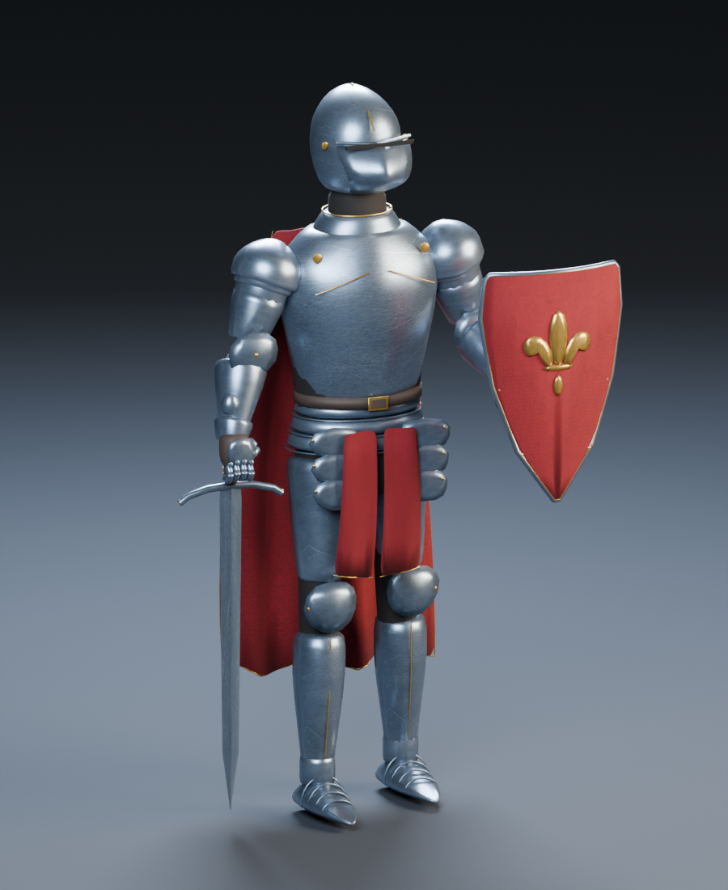

# Crimson Sentinel

An original stylized medieval knight created for this rasterizer, with a fitted bascinet, curved plate armor, articulated arms and hands, shaped sabatons, a draped crimson cape and split tabard, a longsword, and a curved heater shield with a fleur-de-lis relief.

## Files

- `knight.obj`: 29,760 triangles, 15,302 deduplicated positions, UV coordinates and surface normals, across 179 named components. Geometry is triangulated for the rasterizer and other OBJ importers.
- `knight.mtl`: six materials (steel, gold, cloth, leather, and two dark joint/visor variants) referring to the shared atlas.
- `knight_atlas.png`: 1,254 × 1,254 RGBA color texture atlas, with opaque pixels. Top left: steel; top right: engraved gold; bottom left: crimson cloth; bottom right: dark leather.

The soles sit at approximately Y=0.032; the model is approximately 1.90 units tall. Y is up, and the knight faces negative Z. The viewer centers and fits the asset automatically. Parts are separate overlapping surfaces suitable for a static display model; no skeleton or animation is included.

UV islands reuse the four material swatches and stay inset from the quadrant boundaries. Keep all three files in the same directory, or update the relative texture/material references after moving them. No other texture download is needed.

## Edit or regenerate in Blender

Open [the editable Blender project](../../source/knight.blend). Its packed texture, contour meshes, modifiers, materials, camera, and lighting are included. The Blender scene uses Z-up; the export script converts it to the OBJ convention described above.

From the repository root:

```sh
blender --background --python tools/create_knight_blender.py
python tools/validate_knight.py
```

The Blender script regenerates the project and exported OBJ/MTL and creates a studio preview under `build/`. The color atlas is an authored input and is left untouched. Blender is not required to run or build the viewer.



## Texture creation

The atlas was created with the built-in image generation tool, then refined to reduce coarse fabric weave. No reference asset or downloaded model was used. The final refinement prompt was:

> Edit this game texture atlas. Keep EXACTLY the same four equal square quadrants and boundary positions: top left steel, top right gold, bottom left crimson cloth, bottom right dark leather. Replace the overly coarse, carpet-like material treatment with elegant restrained hand-painted fantasy game ALBEDO materials. Surface detail should be extremely subtle and fine, largely smooth from this viewing distance. Top left: smooth clean cold silver-blue forged armor steel, NOT rock/concrete/hammered stone; very fine sparse hairline scuffs, no pits, no dark cracks, no cloudy noise. Top right: smooth warm pale brushed brass, very subtle patina, delicate low-contrast fine ornamental engraved lines, NO big central ornaments, NO heavy grain. Bottom left: smooth deep burgundy/crimson fabric, nearly solid color with exceedingly fine subdued fabric grain visible only close up, NO chunky weave, NO loops, NO carpet, NO knit, NO upholstery, NO visible grid. Bottom right: smooth deep charcoal brown leather, faint fine grain, NO large pebbles, NO heavy wrinkling, NO cobblestone pattern. All surfaces flat evenly lit texture swatches for UV mapping, no baked highlights/shadows, no objects, no labels, no gap or border. Use sophisticated muted saturated colors. This is a texture sheet for metal armor and fine cloth, not a material macro photograph. Preserve exact 2x2 atlas layout.
